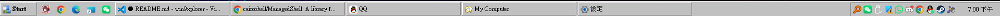
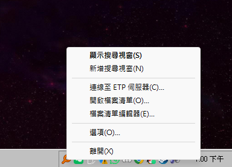
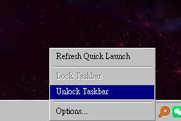
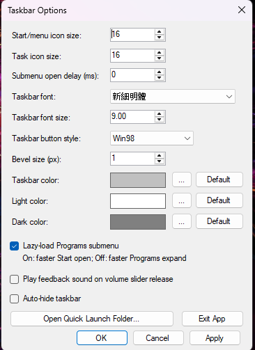
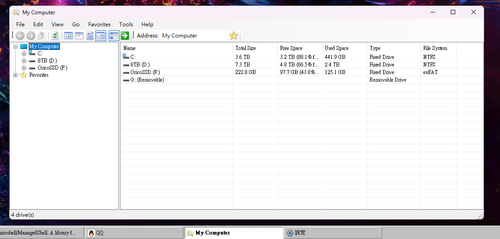
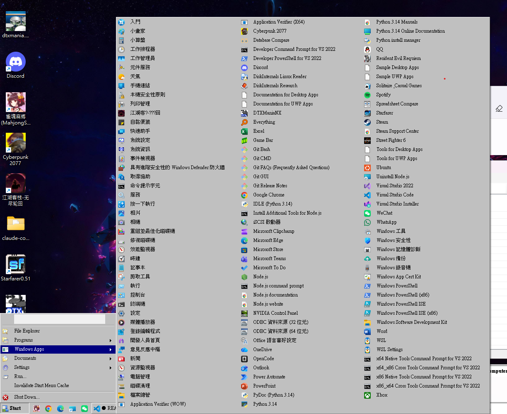
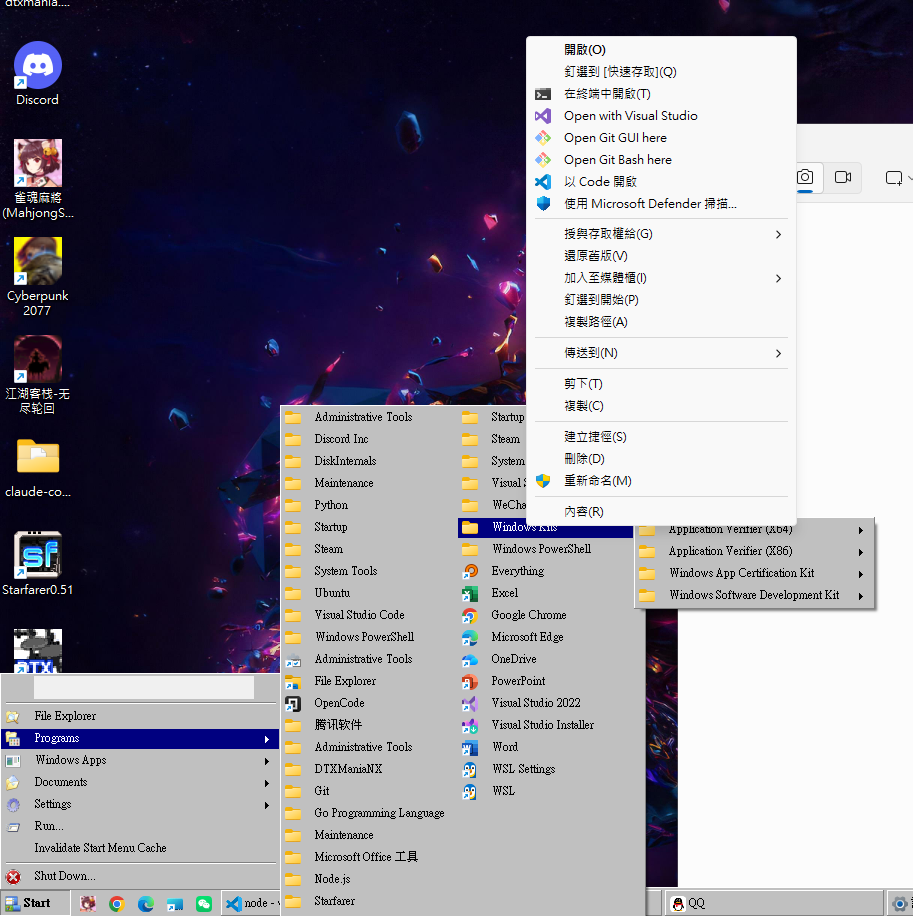
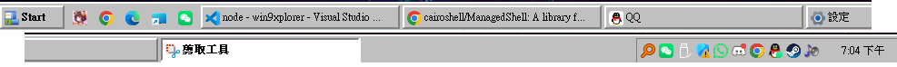

# Win9xplorer

A faithful recreation of the classic Windows 9x experience for modern Windows, featuring a retro file explorer and taskbar with authentic aesthetics and behavior, that AI knows very little.

## Screenshots

Single Bevel Taskbar




Tray icon and menus




Customized Menu Style



Options



File Explorer



Windows Apps Menu for newer apps from Windows Store



Classic Context Menus in Start Menu



Double Bevel (Classic Style)




## Design Philosophy

**Authenticity** – Win9xplorer aims to capture not just the visual appearance of Windows 95/98, but the *feel* of using it. Every bevel, shadow, and interaction pattern is crafted to evoke the genuine retro computing experience.

**Keystrike Matters** – Be sure that high frequency keystrikes(e.g. cursor navigations, searches) that happens in old and new start menus still work.

**Native, No Web / WPF** - For the best responsiveness and memory usage.

## Usage

### Running the Application

```bash
dotnet run --project .\win9xplorer.csproj
```

### Building

```bash
dotnet build
```

The output executable will be in `bin\Debug\net10.0-windows\`.

## Requirements

- Windows 11 or Windows 10
- .NET 10.0 Windows SDK
- Visual Studio 2022 or later (for development)

See [PROJECT_STRUCTURE.md](PROJECT_STRUCTURE.md) for detailed architecture documentation.

## License

GNU GENERAL PUBLIC LICENSE

## Inspired by

[Retrobar](https://github.com/dremin/RetroBar)

[ManagedShell](https://github.com/cairoshell/ManagedShell)
